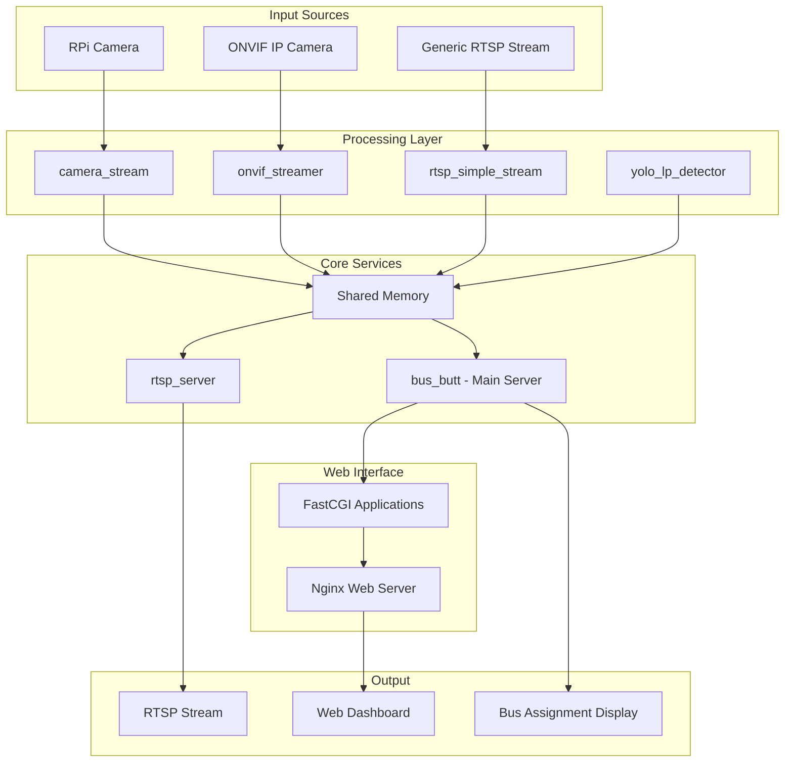

# 🚌 Busbom 버스봄 - Main Server

<div align="center">
  
</div>


[]()
[]()

> **Busbom (버스봄)** - BusBom System Server-side Application (Main)

## 🏗️ Project Overview

Busbom is a smart bus stop guidance system. It automatically monitors and guides bus arrivals and platform status through real-time video processing, AI-based license plate recognition, and ONVIF metadata analysis.

The system consists of a supporting server [platform_observer](https://github.com/BusBom/platform_observer), hardware driver [hardware](https://github.com/BusBom/platform_observer), and client application [Qt_Client](https://github.com/BusBom/Qt_client).

### ✨ Key Features

- 🎥 **Real-time Video Streaming**: Support for RPi cameras and ONVIF IP cameras
- 🔍 **AI-based License Plate Recognition**: YOLOv5n + TensorFlow Lite OCR
- 📡 **RTSP Streaming**: Real-time stream transmission based on MediaMTX
- 🚏 **Platform Status Management**: Real-time monitoring of bus arrivals/departures
- 🌐 **API Interface**: HTTPS API based on FastCGI + Nginx
- 💾 **Shared Memory**: High-performance data exchange between processes

## 📁 Project Structure

```
rpi_server/
├── cgi/                        # FastCGI Web Applications
│   ├── capture.cgi/            # Platform Video Capture API
│   ├── config.cgi/             # Camera Settings Control API
│   ├── roi-setup.cgi/          # ROI Area Setup API
│   ├── stop-status.cgi/        # Bus Stop Status Query API
│   ├── sequence.cgi/           # Bus Approach Sequence API
│   ├── bus-mapping.cgi/        # Bus Route Mapping API
│   └── sleep.cgi/              # STM32 Power Control API
├── camera_stream/              # RPi Camera Streaming
│   ├── main.cpp                # Frame Shared Memory Storage
│   └── CMakeLists.txt
├── yolo_lp_detector/           # YOLO License Plate Detector (Pi Cam)
│   ├── main.cpp                # YOLO + OCR Main Application
│   ├── yolo.cpp/.hpp           # YOLOv5n NCNN Inference Engine
│   ├── tf_ocr.cpp/.hpp         # TensorFlow Lite OCR Engine
│   ├── plate.cpp/.hpp          # License Plate Preprocessing Utilities
│   └── lp_detect_v5n.ncnn.*    # NCNN Model Files
├── onvif_streamer/             # ONVIF Stream Receiver (Hanwha Camera)
│   ├── main.cpp                # RTSP/Metadata Processing
│   ├── video.cpp/.hpp          # Video Stream Processing
│   ├── parser.cpp/.hpp         # ONVIF Metadata Parsing
│   ├── ocr.cpp/.hpp            # License Plate OCR Processing
│   └── model.tflite            # TensorFlow Lite Model
├── bus_butt/                   # Bus Stop Main Algorithm
│   ├── main.cpp                # Main Algorithm
│   ├── bus_station_manager/    # Bus Stop Status Manager
│   ├── bus_queue_fetcher/      # Bus Approach Queue Query
│   ├── display_writer/         # Hardware Output Management
│   └── stop_status_fetcher/    # Bus Stop Status Collector
├── rtsp_server/                # RTSP Stream Server
│   └── main.cpp                # Shared Memory → RTSP Stream Conversion
└── rtsp_simple_stream/         # Generic RTSP Stream Processor
    ├── main.cpp                # RTSP → Shared Memory Conversion
    └── CMakeLists.txt
```

## 🏗️ System Architecture



## 🔧 System Requirements

### Operating Environment
- **Raspberry Pi 4 (8GB RAM recommended)**
- **RPi Camera Module v2/v3** (optional)
- **ONVIF compatible IP camera** (optional)

### Dependencies

| Library | Version | Purpose |
|---------|---------|---------|
| `ncnn` | latest | YOLO inference engine |
| `tensorflow-lite` | 2.6.x | OCR inference engine |
| `opencv4` | 4.x | Image processing |
| `mediamtx` | 1.13+ | RTSP server |
| `ffmpeg` | 4.x+ | Video encoding/decoding |
| `tinyxml2` | latest | XML metadata parsing |
| `libsdl2` | 2.x | Real-time video rendering |
| `libfcgi-dev` | latest | FastCGI web applications |
| `nginx` | 1.18+ | Web server |

## 🚀 Installation and Execution

### 1. Clone Repository
```bash
git clone https://github.com/BusBom/rpi_server.git
cd rpi_server
```

### 2. Install Dependencies
```bash
# Update system packages
sudo apt update && sudo apt upgrade -y

# Install essential packages
sudo apt install -y cmake build-essential pkg-config \
    libopencv-dev libsdl2-dev libtinyxml2-dev \
    libfcgi-dev nginx git cmake 
```
```bash
# Install MediaMTX
wget https://github.com/bluenviron/mediamtx/releases/latest/download/mediamtx_v1.13.0_linux_arm64.tar.gz
tar -xzf mediamtx_v1.13.0_linux_arm64.tar.gz
sudo mv mediamtx /usr/local/bin/
```

### 3. Build
```bash
# Build each module
cd .../build
cmake ..
make

# Build CGI applications
cd cgi
make
sudo make install
```

### 4. Configuration
```bash
# Nginx configuration
# Separate HTTPS and CGI configuration (conf) setup required
sudo cp nginx.conf /etc/nginx/sites-available/busbom
sudo ln -s /etc/nginx/sites-available/busbom /etc/nginx/sites-enabled/
sudo systemctl restart nginx

# MediaMTX configuration
sudo cp mediamtx.yml /etc/mediamtx/
sudo systemctl enable --now mediamtx
```

### 5. Execution
```bash
# Run each module (in separate terminals)
cd camera_stream/build && ./camera_stream
cd yolo_lp_detector/build && ./yolo_detector  
cd onvif_streamer/build && ./onvif_streamer
```

## 📊 Access and Management

### HTTPS Access
```
https://[RaspberryPi_IP]/
```

### API Endpoints

| Endpoint | Method | Description |
|----------|--------|-------------|
| `/cgi-bin/stop-status.cgi` | GET | Query bus stop platform status |
| `/cgi-bin/capture.cgi` | GET | Capture current video frame |
| `/cgi-bin/config.cgi` | POST | Change camera settings |
| `/cgi-bin/roi-setup.cgi` | POST | Set ROI area |
| `/cgi-bin/sequence.cgi` | GET | Query bus route sequence |

### RTSP Stream Access
```
rtsp://[RaspberryPi_IP]:8554/stream
```


